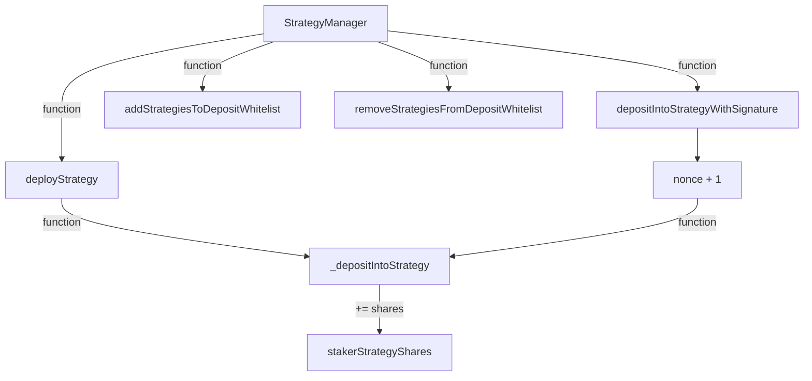
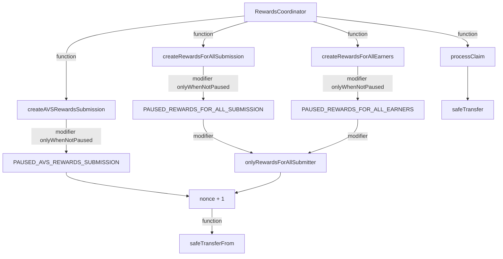
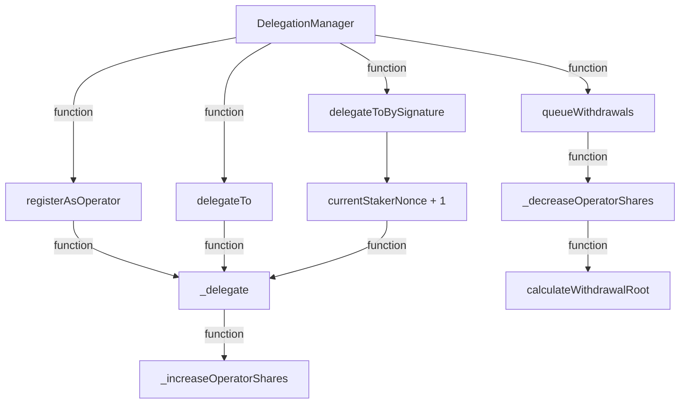
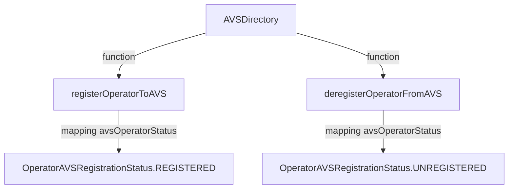

### StrategyManager
Manage staker and it's corresponding strategy shares.

@notice Mapping: staker => Strategy => number of shares which they currently hold

`mapping(address => mapping(IStrategy => uint256)) public stakerStrategyShares;`

### RewardsCoordinator
Contract for reward distribution.

### DelegationManager
delegate operator to operate on staker's behalf, with signature and shares.

### AVSDirectory

