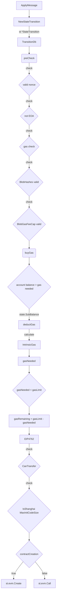
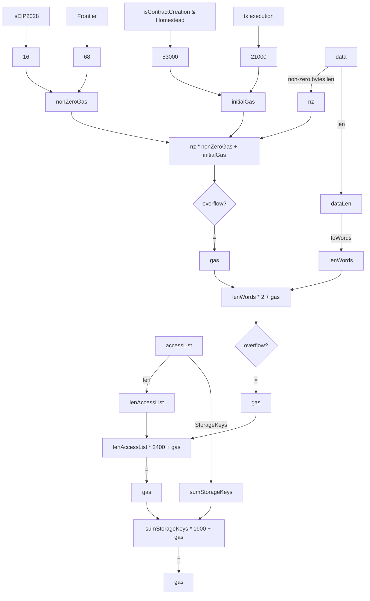

### core.ApplyMessage
`go-ethereum`
https://github.com/ethereum/go-ethereum


path `core./state_transition.go`
line 183


### Containing Information
```
type Message struct {
	To            *common.Address
	From          common.Address
	Nonce         uint64
	Value         *big.Int
	GasLimit      uint64
	GasPrice      *big.Int
	GasFeeCap     *big.Int
	GasTipCap     *big.Int
	Data          []byte
	AccessList    types.AccessList
	BlobGasFeeCap *big.Int
	BlobHashes    []common.Hash

	// When SkipAccountChecks is true, the message nonce is not checked against the
	// account nonce in state. It also disables checking that the sender is an EOA.
	// This field will be set to true for operations like RPC eth_call.
	SkipAccountChecks bool
}
```
**Accounts types**
- Externally Owned Accounts (EOA)
- Smart Contract Accounts (SCA)


GasPrice: This is the price you're willing to pay per unit of gas for executing a transaction or smart contract on the Ethereum network. It's usually denoted in Gwei (1 Gwei = 10^-9 ETH).

GasFeeCap: This is the maximum amount of gas fees you're willing to pay for a transaction. If the calculated gas fee exceeds this cap, the transaction will not be processed.

GasTipCap: This is the maximum amount of tips you're willing to pay to miners for including your transaction in a block. It's a way to incentivize miners to prioritize your transaction.

Value: The Value field represents the amount of Ether (ETH) that is being transferred from the sender to the recipient in the transaction.


**Components of Intrinsic Gas:**

Base Transaction Cost: Every transaction has a base cost of 21,000 gas units. This covers the basic cost of sending a transaction.

Cost of Transaction Data: Each byte of data in the transaction also adds to the intrinsic gas cost. Specifically:

68 gas per non-zero byte of data.

4 gas per zero byte of data.

**EIP4762**

New Gas Costs for Witness Creation:
The proposal introduces specific gas costs for creating
and updating witnesses, which are necessary for stateless clients


**The Merge**

https://ethereum.org/en/roadmap/merge/

Ethereum Mainnet uses proof-of-stake, but this wasn't always the case.
The upgrade from the original proof-of-work mechanism to proof-of-stake was called The Merge.
The Merge refers to the original Ethereum Mainnet merging with a separate proof-of-stake blockchain called the Beacon Chain, now existing as one chain.
The Merge reduced Ethereum's energy consumption by ~99.95%.

**Shanghai Upgrade**
The Shanghai upgrade, also known as the Shanghai/Capella fork,
primarily focuses on enabling the withdrawal of staked Ether (ETH)
and staking rewards. However, it also includes several Ethereum
Improvement Proposals (EIPs) that impact contract creation and
overall network efficiency1.
Key EIPs Related to Contract Creation:

- EIP-3860
  https://eips.ethereum.org/EIPS/eip-3860
  Limit the maximum size of initcode to 49152 and apply extra gas cost of 2 for every 32-byte chunk of initcode.


**Access List Prepare**
- EIP2929: Increased Gas Costs for Certain Operations, so related address need to be record
  later can increase gas fee for that related operations.
- Access List
  The access list is a mechanism used in Ethereum's transaction processing to optimize the execution of transactions
  by providing a list of addresses that the transaction may interact with.

Berlin fork:
- Add sender to access list (2929)
- Add destination to access list (2929)
- Add precompiles to access list (2929)
- Add the contents of the optional tx access list (2930)

Potential EIPs:
- Reset access list (Berlin)
- Add coinbase to access list (EIP-3651)
- Reset transient storage (EIP-1153)


### Gas Calculation
func IntrinsicGas

path `core/state_transition.go`



### EIP4762
(Unclear)
New Gas Costs for Witness Creation:
The proposal introduces specific gas costs for creating
and updating witnesses, which are necessary for stateless clients


