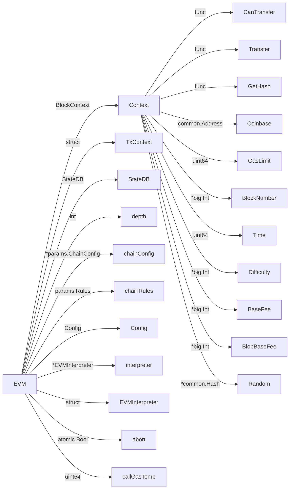
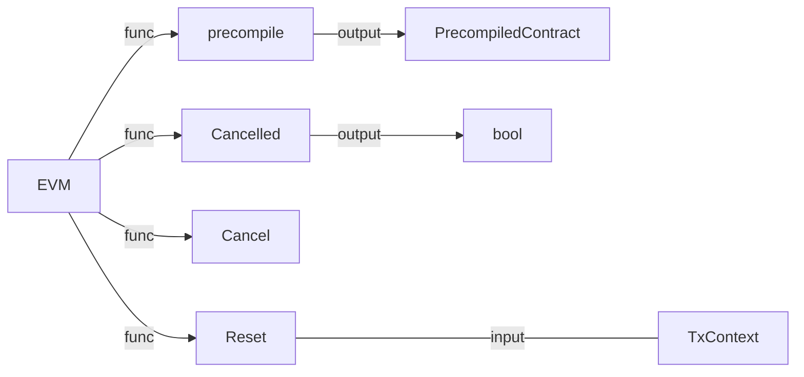

## struct EVM
```
type EVM struct {
	// Context provides auxiliary blockchain related information
	Context BlockContext
	TxContext
	// StateDB gives access to the underlying state
	StateDB StateDB
	// Depth is the current call stack
	depth int

	// chainConfig contains information about the current chain
	chainConfig *params.ChainConfig
	// chain rules contains the chain rules for the current epoch
	chainRules params.Rules
	// virtual machine configuration options used to initialise the
	// evm.
	Config Config
	// global (to this context) ethereum virtual machine
	// used throughout the execution of the tx.
	interpreter *EVMInterpreter
	// abort is used to abort the EVM calling operations
	abort atomic.Bool
	// callGasTemp holds the gas available for the current call. This is needed because the
	// available gas is calculated in gasCall* according to the 63/64 rule and later
	// applied in opCall*.
	callGasTemp uint64
}
```

## struct

## functions


### BlockContext
```
// BlockContext provides the EVM with auxiliary information. Once provided
// it shouldn't be modified.
type BlockContext struct {
	// CanTransfer returns whether the account contains
	// sufficient ether to transfer the value
	CanTransfer CanTransferFunc
	// Transfer transfers ether from one account to the other
	Transfer TransferFunc
	// GetHash returns the hash corresponding to n
	GetHash GetHashFunc

	// Block information
	Coinbase    common.Address // Provides information for COINBASE
	GasLimit    uint64         // Provides information for GASLIMIT
	BlockNumber *big.Int       // Provides information for NUMBER
	Time        uint64         // Provides information for TIME
	Difficulty  *big.Int       // Provides information for DIFFICULTY
	BaseFee     *big.Int       // Provides information for BASEFEE (0 if vm runs with NoBaseFee flag and 0 gas price)
	BlobBaseFee *big.Int       // Provides information for BLOBBASEFEE (0 if vm runs with NoBaseFee flag and 0 blob gas price)
	Random      *common.Hash   // Provides information for PREVRANDAO
}
```
### 
```
type TxContext struct {
	// Message information
	Origin       common.Address      // Provides information for ORIGIN
	GasPrice     *big.Int            // Provides information for GASPRICE (and is used to zero the basefee if NoBaseFee is set)
	BlobHashes   []common.Hash       // Provides information for BLOBHASH
	BlobFeeCap   *big.Int            // Is used to zero the blobbasefee if NoBaseFee is set
	AccessEvents *state.AccessEvents // Capture all state accesses for this tx
}
```
**PrecompiledContract**
```
type PrecompiledContract interface {
	RequiredGas(input []byte) uint64  // RequiredPrice calculates the contract gas use
	Run(input []byte) ([]byte, error) // Run runs the precompiled contract
}
```