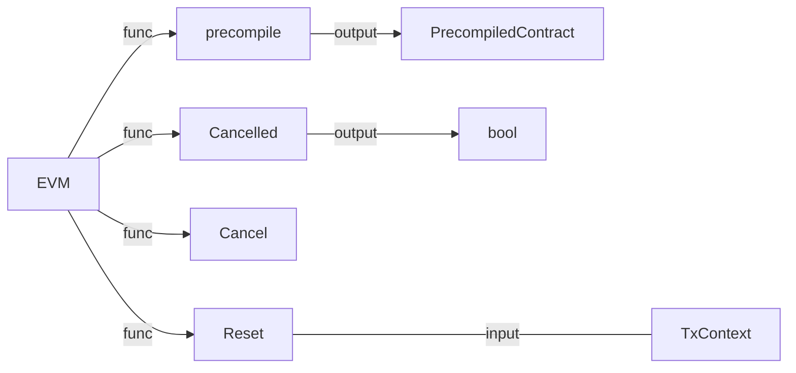

## struct EVM
```
type EVM struct {
	// Context provides auxiliary blockchain related information
	Context BlockContext
	TxContext
	// StateDB gives access to the underlying state
	StateDB StateDB
	// Depth is the current call stack
	depth int

	// chainConfig contains information about the current chain
	chainConfig *params.ChainConfig
	// chain rules contains the chain rules for the current epoch
	chainRules params.Rules
	// virtual machine configuration options used to initialise the
	// evm.
	Config Config
	// global (to this context) ethereum virtual machine
	// used throughout the execution of the tx.
	interpreter *EVMInterpreter
	// abort is used to abort the EVM calling operations
	abort atomic.Bool
	// callGasTemp holds the gas available for the current call. This is needed because the
	// available gas is calculated in gasCall* according to the 63/64 rule and later
	// applied in opCall*.
	callGasTemp uint64
}
```

## struct

```mermaid
graph LR
    EVM --> |BlockContext|BlockContext[Context]
    EVM --> |struct|TxContext
    EVM --> |StateDB|StateDB
    EVM --> |int|depth
    EVM --> |*params.ChainConfig|ChainConfig
    EVM --> |params.Rules|Rules
    EVM --> |Config|Config
    EVM --> |*EVMInterpreter|interpreter
    EVM --> |struct|EVMInterpreter
    EVM --> |atomic.Bool|abort
    EVM --> |uint64|callGasTemp

    BlockContext --> |func|CanTransfer
    BlockContext --> |func|Transfer
    BlockContext --> |func|GetHash
    BlockContext --> |common.Address|Coinbase
    BlockContext --> |uint64|GasLimit
    BlockContext --> |*big.Int|BlockNumber
    BlockContext --> |uint64|Time
    BlockContext --> |*big.Int|Difficulty
    BlockContext --> |*big.Int|BaseFee
    BlockContext --> |*big.Int|BlobBaseFee
    BlockContext --> |*common.Hash|Random

    TxContext --> |common.Address|Origin
    TxContext --> |*big.Int|GasPrice
    TxContext --> |array common.Hash|BlobHashes
    TxContext --> |*big.Int|BlobFeeCap
    TxContext --> |*state.AccessEvents|AccessEvents
    
    StateDB --> |func|CreateAccount
    StateDB --> |func|CreateContract
    StateDB --> |func|SubBalance
    StateDB --> |func|AddBalance
    StateDB --> |func|GetBalance
    StateDB --> |func|GetNonce
    StateDB --> |func|SetNonce
    StateDB --> |func|GetCodeHash
    StateDB --> |func|GetCode
    StateDB --> |func|SetCode
    StateDB --> |func|GetCodeSize
    StateDB --> |func|AddRefund
    StateDB --> |func|SubRefund
    StateDB --> |func|GetRefund
    StateDB --> |func|GetCommittedState
    StateDB --> |func|GetState
    StateDB --> |func|SetState
    StateDB --> |func|GetStorageRoot
    StateDB --> |func|GetTransientState
    StateDB --> |func|SetTransientState
    StateDB --> |func|SelfDestruct
    StateDB --> |func|HasSelfDestructed
    StateDB --> |func|Selfdestruct6780
    StateDB --> |func|Exist
    StateDB --> |func|Empty
    StateDB --> |func|AddressInAccessList
    StateDB --> |func|SlotInAccessList
    StateDB --> |func|AddAddressToAccessList
    StateDB --> |func|AddSlotToAccessList
    StateDB --> |func|PointCache
    StateDB --> |func|Prepare
    StateDB --> |func|RevertToSnapshot
    StateDB --> |func|Snapshot
    StateDB --> |func|AddLog
    StateDB --> |func|AddPreimage

    ChainConfig --> |*big.Int|ChainID
    ChainConfig --> |*big.Int|HomesteadBlock
    ChainConfig --> |*big.Int|DAOForkBlock
    ChainConfig --> |bool|DAOForkSupport
    ChainConfig --> |*big.Int|EIP150Block
    ChainConfig --> |*big.Int|EIP155Block
    ChainConfig --> |*big.Int|EIP158Block
    ChainConfig --> |*big.Int|ByzantiumBlock
    ChainConfig --> |*big.Int|ConstantinopleBlock
    ChainConfig --> |*big.Int|PetersburgBlock
    ChainConfig --> |*big.Int|IstanbulBlock
    ChainConfig --> |*big.Int|MuirGlacierBlock
    ChainConfig --> |*big.Int|BerlinBlock
    ChainConfig --> |*big.Int|LondonBlock
    ChainConfig --> |*big.Int|ArrowGlacierBlock
    ChainConfig --> |*big.Int|GrayGlacierBlock
    ChainConfig --> |*big.Int|MergeNetsplitBlock
    ChainConfig --> |*uint64|ShanghaiTime
    ChainConfig --> |*uint64|CancunTime
    ChainConfig --> |*uint64|PragueTime
    ChainConfig --> |*uint64|VerkleTime
    ChainConfig --> |*big.Int|TerminalTotalDifficulty
    ChainConfig --> |bool|TerminalTotalDifficultyPassed
    ChainConfig --> |*EthashConfig|Ethash
    ChainConfig --> |*CliqueConfig|Clique



    Rules --> |*big.Int|ChainID
    Rules --> |bool|IsHomestead
    Rules --> |bool|IsEIP150
    Rules --> |bool|IsEIP155
    Rules --> |bool|IsEIP158
    Rules --> |bool|IsEIP2929
    Rules --> |bool|IsEIP4762
    Rules --> |bool|IsByzantium
    Rules --> |bool|IsConstantinople
    Rules --> |bool|IsPetersburg
    Rules --> |bool|IsIstanbul
    Rules --> |bool|IsBerlin
    Rules --> |bool|IsLondon
    Rules --> |bool|IsMerge
    Rules --> |bool|IsShanghai
    Rules --> |bool|IsCancun
    Rules --> |bool|IsPrague
    Rules --> |bool|IsVerkle

    Config --> |*tracing.Hooks|Tracer
    Config --> |bool|NoBaseFee
    Config --> |bool|EnablePreimageRecording
    Config --> |array int|ExtraEips

    EVMInterpreter --> |*EVM|EVM
    EVMInterpreter --> |*JumpTable|table
    EVMInterpreter --> |crypto.KeccakState|hasher
    EVMInterpreter --> |common.Hash|hasherBuf
    EVMInterpreter --> |bool|readOnly
    EVMInterpreter --> |array byte|returnData
```

## functions


### BlockContext
```
// BlockContext provides the EVM with auxiliary information. Once provided
// it shouldn't be modified.
type BlockContext struct {
	// CanTransfer returns whether the account contains
	// sufficient ether to transfer the value
	CanTransfer CanTransferFunc
	// Transfer transfers ether from one account to the other
	Transfer TransferFunc
	// GetHash returns the hash corresponding to n
	GetHash GetHashFunc

	// Block information
	Coinbase    common.Address // Provides information for COINBASE
	GasLimit    uint64         // Provides information for GASLIMIT
	BlockNumber *big.Int       // Provides information for NUMBER
	Time        uint64         // Provides information for TIME
	Difficulty  *big.Int       // Provides information for DIFFICULTY
	BaseFee     *big.Int       // Provides information for BASEFEE (0 if vm runs with NoBaseFee flag and 0 gas price)
	BlobBaseFee *big.Int       // Provides information for BLOBBASEFEE (0 if vm runs with NoBaseFee flag and 0 blob gas price)
	Random      *common.Hash   // Provides information for PREVRANDAO
}
```
### TxContext
```
type TxContext struct {
	// Message information
	Origin       common.Address      // Provides information for ORIGIN
	GasPrice     *big.Int            // Provides information for GASPRICE (and is used to zero the basefee if NoBaseFee is set)
	BlobHashes   []common.Hash       // Provides information for BLOBHASH
	BlobFeeCap   *big.Int            // Is used to zero the blobbasefee if NoBaseFee is set
	AccessEvents *state.AccessEvents // Capture all state accesses for this tx
}
```
### PrecompiledContract
```
type PrecompiledContract interface {
	RequiredGas(input []byte) uint64  // RequiredPrice calculates the contract gas use
	Run(input []byte) ([]byte, error) // Run runs the precompiled contract
}
```

### StateDB
```
type StateDB interface {
	CreateAccount(common.Address)
	CreateContract(common.Address)

	SubBalance(common.Address, *uint256.Int, tracing.BalanceChangeReason)
	AddBalance(common.Address, *uint256.Int, tracing.BalanceChangeReason)
	GetBalance(common.Address) *uint256.Int

	GetNonce(common.Address) uint64
	SetNonce(common.Address, uint64)

	GetCodeHash(common.Address) common.Hash
	GetCode(common.Address) []byte
	SetCode(common.Address, []byte)
	GetCodeSize(common.Address) int

	AddRefund(uint64)
	SubRefund(uint64)
	GetRefund() uint64

	GetCommittedState(common.Address, common.Hash) common.Hash
	GetState(common.Address, common.Hash) common.Hash
	SetState(common.Address, common.Hash, common.Hash)
	GetStorageRoot(addr common.Address) common.Hash

	GetTransientState(addr common.Address, key common.Hash) common.Hash
	SetTransientState(addr common.Address, key, value common.Hash)

	SelfDestruct(common.Address)
	HasSelfDestructed(common.Address) bool

	Selfdestruct6780(common.Address)

	// Exist reports whether the given account exists in state.
	// Notably this should also return true for self-destructed accounts.
	Exist(common.Address) bool
	// Empty returns whether the given account is empty. Empty
	// is defined according to EIP161 (balance = nonce = code = 0).
	Empty(common.Address) bool

	AddressInAccessList(addr common.Address) bool
	SlotInAccessList(addr common.Address, slot common.Hash) (addressOk bool, slotOk bool)
	// AddAddressToAccessList adds the given address to the access list. This operation is safe to perform
	// even if the feature/fork is not active yet
	AddAddressToAccessList(addr common.Address)
	// AddSlotToAccessList adds the given (address,slot) to the access list. This operation is safe to perform
	// even if the feature/fork is not active yet
	AddSlotToAccessList(addr common.Address, slot common.Hash)

	// PointCache returns the point cache used in computations
	PointCache() *utils.PointCache

	Prepare(rules params.Rules, sender, coinbase common.Address, dest *common.Address, precompiles []common.Address, txAccesses types.AccessList)

	RevertToSnapshot(int)
	Snapshot() int

	AddLog(*types.Log)
	AddPreimage(common.Hash, []byte)
}
```

### ChainConfig
```
// ChainConfig is the core config which determines the blockchain settings.
//
// ChainConfig is stored in the database on a per block basis. This means
// that any network, identified by its genesis block, can have its own
// set of configuration options.
type ChainConfig struct {
	ChainID *big.Int `json:"chainId"` // chainId identifies the current chain and is used for replay protection

	HomesteadBlock *big.Int `json:"homesteadBlock,omitempty"` // Homestead switch block (nil = no fork, 0 = already homestead)

	DAOForkBlock   *big.Int `json:"daoForkBlock,omitempty"`   // TheDAO hard-fork switch block (nil = no fork)
	DAOForkSupport bool     `json:"daoForkSupport,omitempty"` // Whether the nodes supports or opposes the DAO hard-fork

	// EIP150 implements the Gas price changes (https://github.com/ethereum/EIPs/issues/150)
	EIP150Block *big.Int `json:"eip150Block,omitempty"` // EIP150 HF block (nil = no fork)
	EIP155Block *big.Int `json:"eip155Block,omitempty"` // EIP155 HF block
	EIP158Block *big.Int `json:"eip158Block,omitempty"` // EIP158 HF block

	ByzantiumBlock      *big.Int `json:"byzantiumBlock,omitempty"`      // Byzantium switch block (nil = no fork, 0 = already on byzantium)
	ConstantinopleBlock *big.Int `json:"constantinopleBlock,omitempty"` // Constantinople switch block (nil = no fork, 0 = already activated)
	PetersburgBlock     *big.Int `json:"petersburgBlock,omitempty"`     // Petersburg switch block (nil = same as Constantinople)
	IstanbulBlock       *big.Int `json:"istanbulBlock,omitempty"`       // Istanbul switch block (nil = no fork, 0 = already on istanbul)
	MuirGlacierBlock    *big.Int `json:"muirGlacierBlock,omitempty"`    // Eip-2384 (bomb delay) switch block (nil = no fork, 0 = already activated)
	BerlinBlock         *big.Int `json:"berlinBlock,omitempty"`         // Berlin switch block (nil = no fork, 0 = already on berlin)
	LondonBlock         *big.Int `json:"londonBlock,omitempty"`         // London switch block (nil = no fork, 0 = already on london)
	ArrowGlacierBlock   *big.Int `json:"arrowGlacierBlock,omitempty"`   // Eip-4345 (bomb delay) switch block (nil = no fork, 0 = already activated)
	GrayGlacierBlock    *big.Int `json:"grayGlacierBlock,omitempty"`    // Eip-5133 (bomb delay) switch block (nil = no fork, 0 = already activated)
	MergeNetsplitBlock  *big.Int `json:"mergeNetsplitBlock,omitempty"`  // Virtual fork after The Merge to use as a network splitter

	// Fork scheduling was switched from blocks to timestamps here

	ShanghaiTime *uint64 `json:"shanghaiTime,omitempty"` // Shanghai switch time (nil = no fork, 0 = already on shanghai)
	CancunTime   *uint64 `json:"cancunTime,omitempty"`   // Cancun switch time (nil = no fork, 0 = already on cancun)
	PragueTime   *uint64 `json:"pragueTime,omitempty"`   // Prague switch time (nil = no fork, 0 = already on prague)
	VerkleTime   *uint64 `json:"verkleTime,omitempty"`   // Verkle switch time (nil = no fork, 0 = already on verkle)

	// TerminalTotalDifficulty is the amount of total difficulty reached by
	// the network that triggers the consensus upgrade.
	TerminalTotalDifficulty *big.Int `json:"terminalTotalDifficulty,omitempty"`

	// TerminalTotalDifficultyPassed is a flag specifying that the network already
	// passed the terminal total difficulty. Its purpose is to disable legacy sync
	// even without having seen the TTD locally (safer long term).
	//
	// TODO(karalabe): Drop this field eventually (always assuming PoS mode)
	TerminalTotalDifficultyPassed bool `json:"terminalTotalDifficultyPassed,omitempty"`

	// Various consensus engines
	Ethash *EthashConfig `json:"ethash,omitempty"`
	Clique *CliqueConfig `json:"clique,omitempty"`
}
```

### Rules
```
type Rules struct {
	ChainID                                                 *big.Int
	IsHomestead, IsEIP150, IsEIP155, IsEIP158               bool
	IsEIP2929, IsEIP4762                                    bool
	IsByzantium, IsConstantinople, IsPetersburg, IsIstanbul bool
	IsBerlin, IsLondon                                      bool
	IsMerge, IsShanghai, IsCancun, IsPrague                 bool
	IsVerkle                                                bool
}
```

### Config
```
// Config are the configuration options for the Interpreter
type Config struct {
	Tracer                  *tracing.Hooks
	NoBaseFee               bool  // Forces the EIP-1559 baseFee to 0 (needed for 0 price calls)
	EnablePreimageRecording bool  // Enables recording of SHA3/keccak preimages
	ExtraEips               []int // Additional EIPS that are to be enabled
}
```

### EVMInterpreter
```
// EVMInterpreter represents an EVM interpreter
type EVMInterpreter struct {
	evm   *EVM
	table *JumpTable

	hasher    crypto.KeccakState // Keccak256 hasher instance shared across opcodes
	hasherBuf common.Hash        // Keccak256 hasher result array shared across opcodes

	readOnly   bool   // Whether to throw on stateful modifications
	returnData []byte // Last CALL's return data for subsequent reuse
}
```