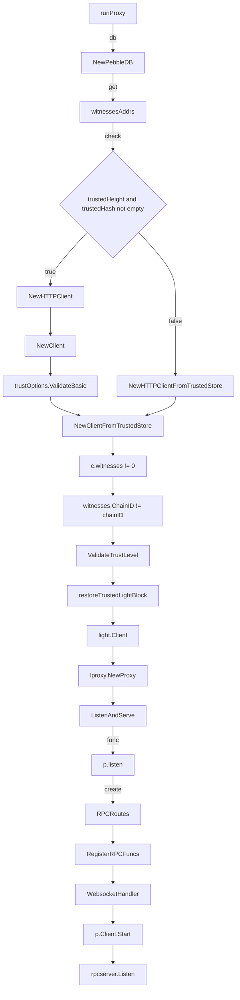
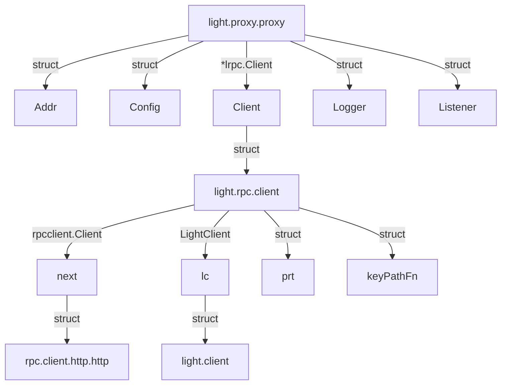

## LightCmd
Basic Process for start a light client

## Structure


### light.proxy.proxy
```
type Proxy struct {
	Addr     string // TCP address to listen on, ":http" if empty
	Config   *rpcserver.Config
	Client   *lrpc.Client
	Logger   log.Logger
	Listener net.Listener
}
```

### light.rpc.client
```
type Client struct {
	service.BaseService

	next rpcclient.Client
	lc   LightClient

	// proof runtime used to verify values returned by ABCIQuery
	prt       *merkle.ProofRuntime
	keyPathFn KeyPathFunc
}
```

### rpc.client.http.http
```
type HTTP struct {
	remote string
	rpc    *jsonrpcclient.Client

	*baseRPCClient
	*WSEvents
}
```

### light.client
```light.client
type Client struct {
	chainID          string
	trustingPeriod   time.Duration // see TrustOptions.Period
	verificationMode mode
	trustLevel       cmtmath.Fraction
	maxRetryAttempts uint16 // see MaxRetryAttempts option
	maxClockDrift    time.Duration
	maxBlockLag      time.Duration

	// Mutex for locking during changes of the light clients providers
	providerMutex cmtsync.Mutex
	// Primary provider of new headers.
	primary provider.Provider
	// Providers used to "witness" new headers.
	witnesses []provider.Provider

	// Where trusted light blocks are stored.
	trustedStore store.Store
	// Highest trusted light block from the store (height=H).
	latestTrustedBlock *types.LightBlock

	// See RemoveNoLongerTrustedHeadersPeriod option
	pruningSize uint16
	// See ConfirmationFunction option
	confirmationFn func(action string) bool

	quit chan struct{}

	lo
```

