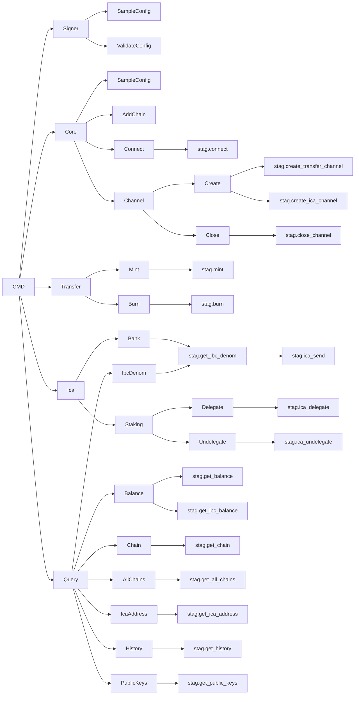

## Repo
https://github.com/devashishdxt/stag
## Usage Tear Down
Command line usage router

```mermaid
graph LR
    CMD --> Signer
    CMD --> Core
    CMD --> Transfer
    CMD --> Ica
    CMD --> Query
    
    
    Signer --> SampleConfig1[SampleConfig]
    Signer --> ValidateConfig

    Core --> SampleConfig2[SampleConfig]
    Core --> AddChain
    Core --> Connect
    Connect --> stag.connect
    Core --> Channel
    Channel --> Create
    Create --> stag.create_transfer_channel
    Create --> stag.create_ica_channel
    Channel --> Close
    Close --> stag.close_channel
    
    Transfer --> Mint
    Transfer --> Burn
    Mint --> stag.mint
    Burn --> stag.burn
    
    Ica --> Bank
    Ica --> Staking
    Bank --> stag.get_ibc_denom
    stag.get_ibc_denom --> stag.ica_send
    Staking --> Delegate
    Staking --> Undelegate
    Delegate --> stag.ica_delegate
    Undelegate --> stag.ica_undelegate

    Query --> Balance
    Query --> Chain
    Query --> AllChains
    Query --> IbcDenom
    Query --> IcaAddress
    Query --> History
    Query --> PublicKeys
    Balance --> stag.get_balance
    Balance --> stag.get_ibc_balance
    Chain --> stag.get_chain
    AllChains --> stag.get_all_chains
    IbcDenom --> stag.get_ibc_denom
    IcaAddress --> stag.get_ica_address
    History --> stag.get_history
    PublicKeys --> stag.get_public_keys
```

### Stag function
path `stag-api/src/stag/api.rs`
