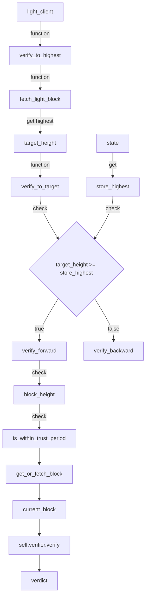
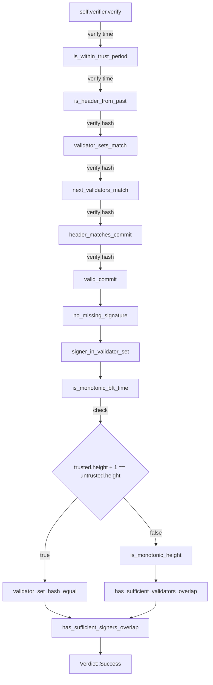
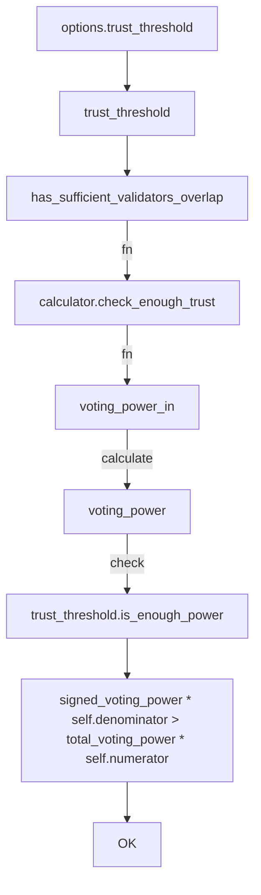
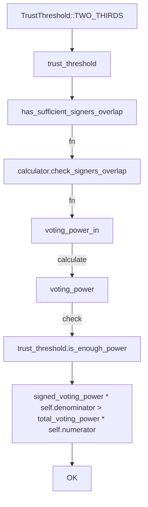

## Supervisor Verify
path `light-client/src/supervisor.rs`

### self.verifier.verify

### has_sufficient_validators_overlap
Check that there is enough validators overlap between the trusted validator set
nd the untrusted signed header.

### has_sufficient_signers_overlap
Check that there is enough signers overlap between the given, untrusted validator set
and the untrusted signed header.

Verify that more than 2/3 of the validators correctly committed the block
