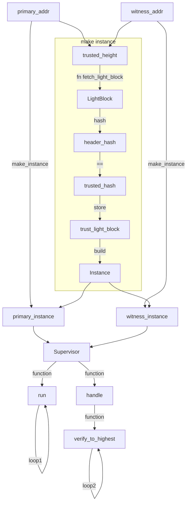
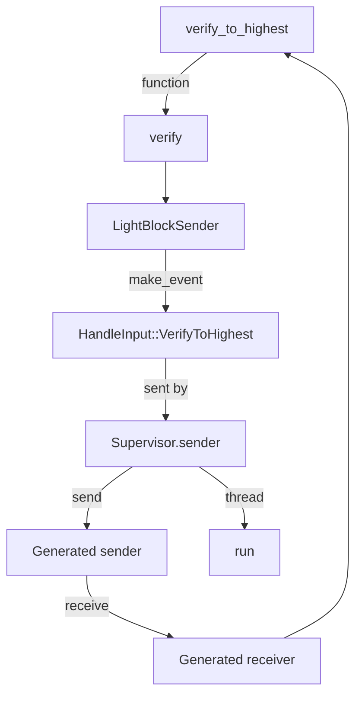
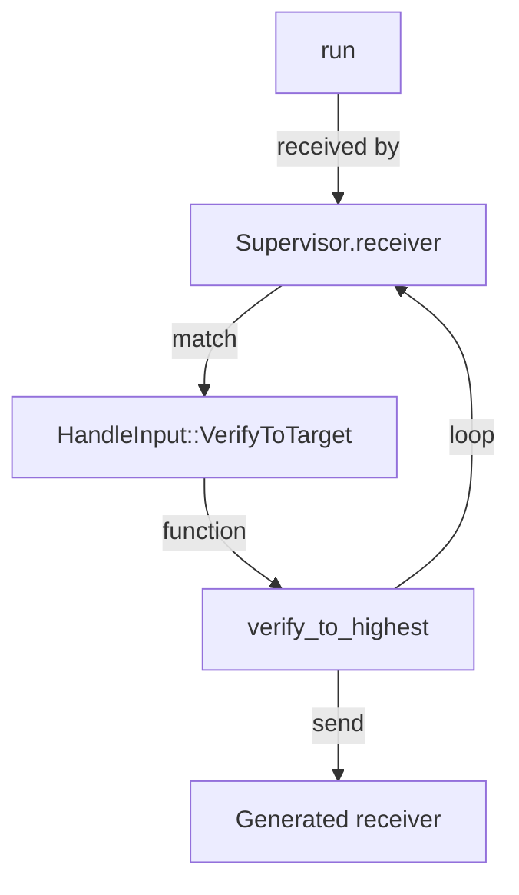

## Example
This shows how to use light client sdk.

### Loop1

### Loop2



### LightBlock
Contains block information for light client.
```rust
pub struct LightBlock {
    /// Header and commit of this block
    pub signed_header: SignedHeader,
    /// Validator set at the block height
    #[serde(rename = "validator_set")]
    pub validators: ValidatorSet,
    /// Validator set at the next block height
    #[serde(rename = "next_validator_set")]
    pub next_validators: ValidatorSet,
    /// The peer ID of the node that provided this block
    pub provider: PeerId,
}
```

