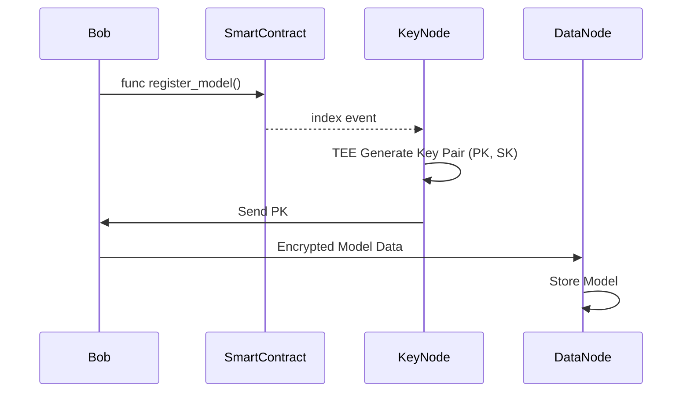
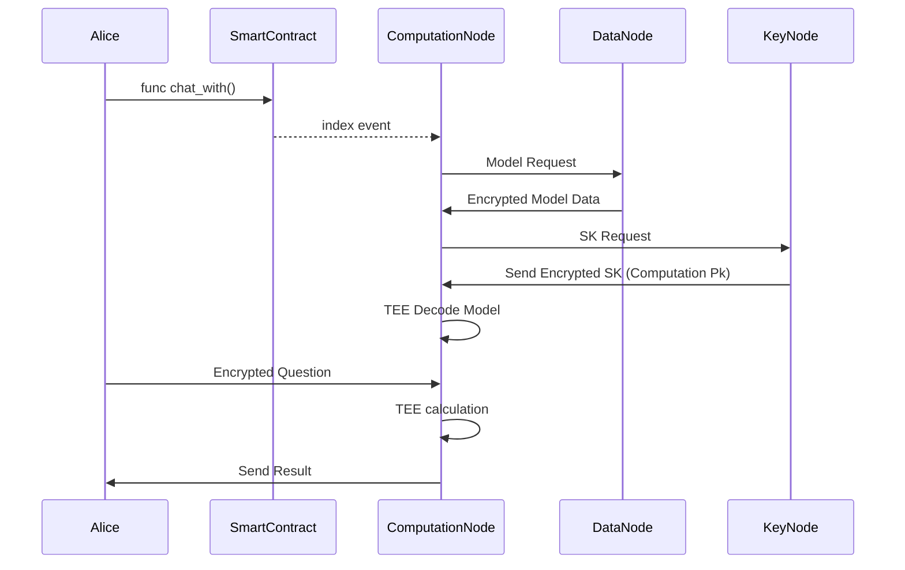

## Register

```mermaid
sequenceDiagram
    Bob ->> SmartContract: func register_model()
    SmartContract -->> KeyNode: index event
    KeyNode ->> KeyNode: TEE Generate Key Pair (PK, SK)
    KeyNode ->> Bob: Send PK
    Bob ->> DataNode: Encrypted Model Data
    DataNode ->> DataNode: Store Model

```

## Chat

```mermaid
sequenceDiagram
    Alice ->> SmartContract: func chat_with()
    SmartContract -->> ComputationNode: index event
    ComputationNode ->> DataNode: Model Request
    DataNode ->> ComputationNode: Encrypted Model Data
    ComputationNode ->> KeyNode: SK Request
    KeyNode ->> ComputationNode: Send Encrypted SK (Computation Pk)
    ComputationNode ->> ComputationNode: TEE Decode Model
    Alice ->> ComputationNode: Encrypted Question
    ComputationNode ->> ComputationNode: TEE calculation
    ComputationNode ->> Alice: Send Result
```

