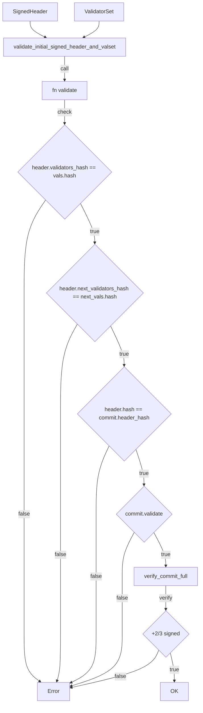
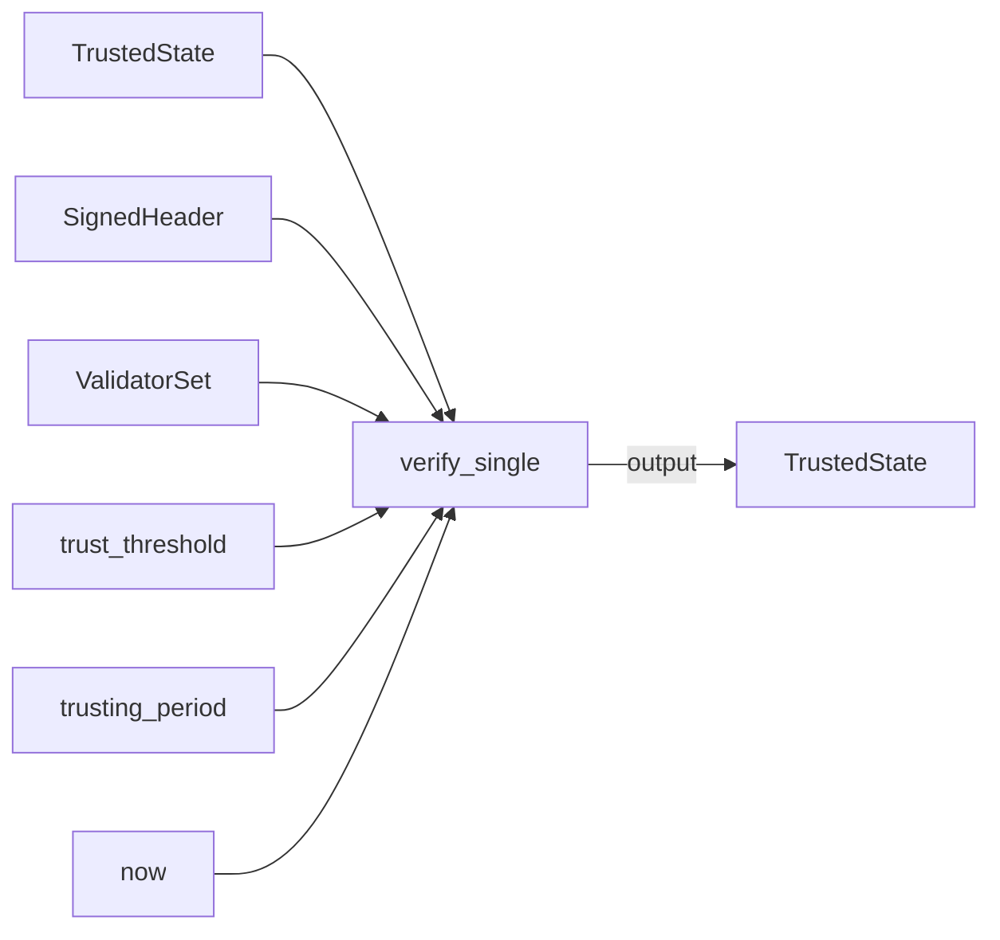

## Repo
https://github.com/ChorusOne/tendermint-light-client

## Tear Down

### Initial Verify

```mermaid
graph TD
    SignedHeader2[SignedHeader] --> validate_initial_signed_header_and_valset
    ValidatorSet2[ValidatorSet] --> validate_initial_signed_header_and_valset
    validate_initial_signed_header_and_valset --> |call|validate[fn validate]
    validate --> |check|hash_verify1{header.validators_hash == vals.hash}
    hash_verify1 --> |false|return_err[Error]
    hash_verify1 --> |true|hash_verify2{header.next_validators_hash == next_vals.hash}
    hash_verify2 --> |false|return_err[Error]
    hash_verify2 --> |true|hash_verify3{header.hash == commit.header_hash}
    hash_verify3 --> |false|return_err[Error]
    hash_verify3 --> |true|hash_verify4{commit.validate}
    hash_verify4 --> |false|return_err[Error]
    hash_verify4 --> |true|verify_commit_full
    verify_commit_full --> |verify|hash_verify5{+2/3 signed}
    hash_verify5 --> |false|return_err[Error]
    hash_verify5 --> |true|OK
```

### Verify

```mermaid
graph LR

    TrustedState1[TrustedState] --> verify_single
    SignedHeader1[SignedHeader] --> verify_single
    ValidatorSet1[ValidatorSet] --> verify_single
    trust_threshold --> verify_single
    trusting_period --> verify_single
    now --> verify_single
    
    verify_single --> |output|TrustedState2[TrustedState]

```