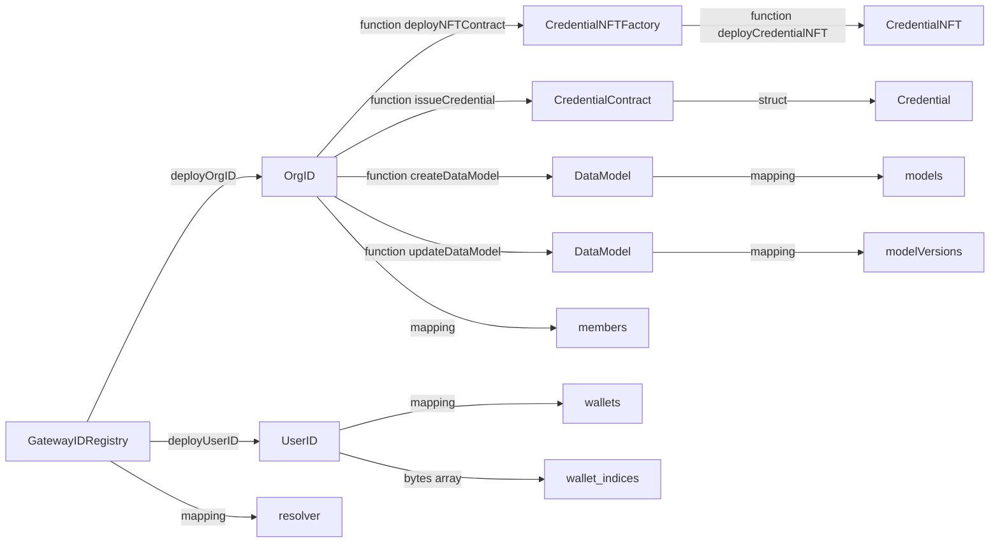

```mermaid
graph LR
    CredentialNFTFactory -->|function deployCredentialNFT| CredentialNFT
    CredentialContract -->|struct| Credential

    DataModel1[DataModel] --> |mapping| models
    DataModel2[DataModel] --> |mapping| modelVersions
    
    OrgID -->|mapping| members
    OrgID -->|function deployNFTContract| CredentialNFTFactory
    OrgID -->|function issueCredential| CredentialContract
    OrgID -->|function createDataModel| DataModel1
    OrgID -->|function updateDataModel| DataModel2

    UserID -->|mapping| wallets
    UserID -->|bytes array| wallet_indices
    
    GatewayIDRegistry -->|deployOrgID| OrgID
    GatewayIDRegistry -->|deployUserID| UserID
    GatewayIDRegistry -->|mapping| resolver
```
