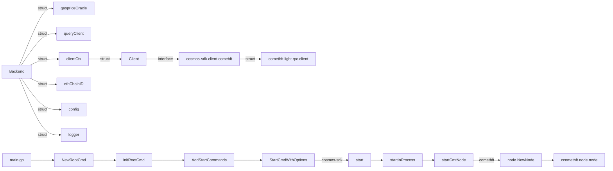

# RpcBackend




### cometbft.light.rpc.client
```
type Client struct {
	service.BaseService

	next rpcclient.Client
	lc   LightClient

	// proof runtime used to verify values returned by ABCIQuery
	prt       *merkle.ProofRuntime
	keyPathFn KeyPathFunc
}
```

### ccometbft.node.node
Node is the highest level interface to a full CometBFT node.

It includes all configuration information and running services.
```
type Node struct {
	service.BaseService

	// config
	config        *cfg.Config
	genesisTime   time.Time
	privValidator types.PrivValidator // local node's validator key
    ...
}
```