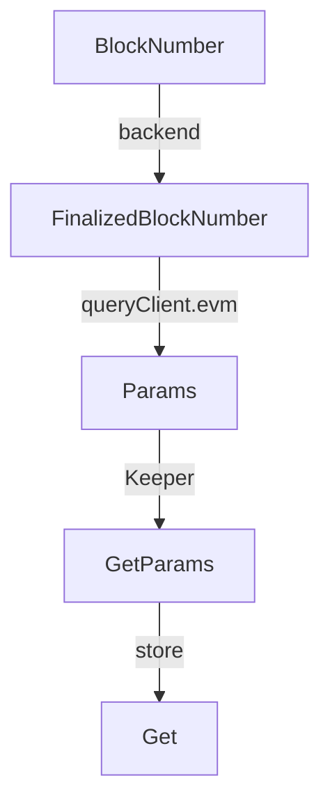

# eth_blockNumber

```mermaid
graph TD
    BlockNumber --> |backend|FinalizedBlockNumber
    FinalizedBlockNumber -->|queryClient.evm|Params
    Params -->|Keeper|GetParams
    GetParams --> |store|Get
```