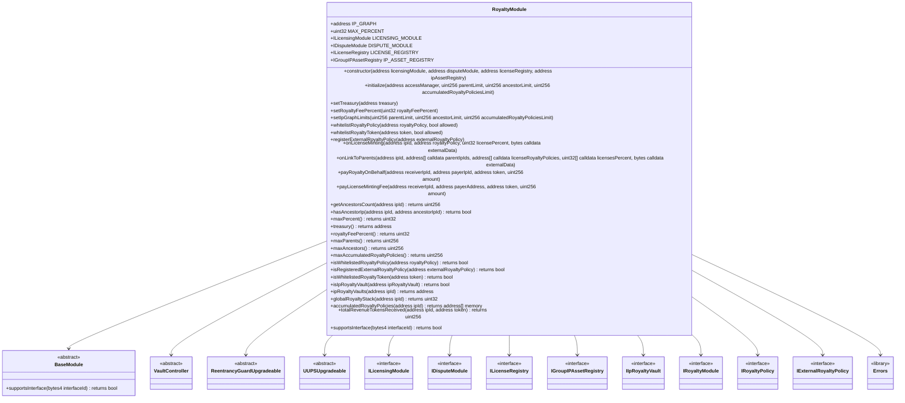

Certainly! Below is a Mermaid diagram that represents the structure and relationships within the `RoyaltyModule` contract.

```mermaid
classDiagram
    class RoyaltyModule {
        +address IP_GRAPH
        +uint32 MAX_PERCENT
        +ILicensingModule LICENSING_MODULE
        +IDisputeModule DISPUTE_MODULE
        +ILicenseRegistry LICENSE_REGISTRY
        +IGroupIPAssetRegistry IP_ASSET_REGISTRY
        +constructor(address licensingModule, address disputeModule, address licenseRegistry, address ipAssetRegistry)
        +initialize(address accessManager, uint256 parentLimit, uint256 ancestorLimit, uint256 accumulatedRoyaltyPoliciesLimit)
        +setTreasury(address treasury)
        +setRoyaltyFeePercent(uint32 royaltyFeePercent)
        +setIpGraphLimits(uint256 parentLimit, uint256 ancestorLimit, uint256 accumulatedRoyaltyPoliciesLimit)
        +whitelistRoyaltyPolicy(address royaltyPolicy, bool allowed)
        +whitelistRoyaltyToken(address token, bool allowed)
        +registerExternalRoyaltyPolicy(address externalRoyaltyPolicy)
        +onLicenseMinting(address ipId, address royaltyPolicy, uint32 licensePercent, bytes calldata externalData)
        +onLinkToParents(address ipId, address[] calldata parentIpIds, address[] calldata licenseRoyaltyPolicies, uint32[] calldata licensesPercent, bytes calldata externalData)
        +payRoyaltyOnBehalf(address receiverIpId, address payerIpId, address token, uint256 amount)
        +payLicenseMintingFee(address receiverIpId, address payerAddress, address token, uint256 amount)
        +getAncestorsCount(address ipId) returns uint256
        +hasAncestorIp(address ipId, address ancestorIpId) returns bool
        +maxPercent() returns uint32
        +treasury() returns address
        +royaltyFeePercent() returns uint32
        +maxParents() returns uint256
        +maxAncestors() returns uint256
        +maxAccumulatedRoyaltyPolicies() returns uint256
        +isWhitelistedRoyaltyPolicy(address royaltyPolicy) returns bool
        +isRegisteredExternalRoyaltyPolicy(address externalRoyaltyPolicy) returns bool
        +isWhitelistedRoyaltyToken(address token) returns bool
        +isIpRoyaltyVault(address ipRoyaltyVault) returns bool
        +ipRoyaltyVaults(address ipId) returns address
        +globalRoyaltyStack(address ipId) returns uint32
        +accumulatedRoyaltyPolicies(address ipId) returns address[] memory
        +totalRevenueTokensReceived(address ipId, address token) returns uint256
        +supportsInterface(bytes4 interfaceId) returns bool
    }

    class BaseModule {
        <<abstract>>
        +supportsInterface(bytes4 interfaceId) returns bool
    }

    class VaultController {
        <<abstract>>
    }

    class ReentrancyGuardUpgradeable {
        <<abstract>>
    }

    class UUPSUpgradeable {
        <<abstract>>
    }

    class ILicensingModule {
        <<interface>>
    }

    class IDisputeModule {
        <<interface>>
    }

    class ILicenseRegistry {
        <<interface>>
    }

    class IGroupIPAssetRegistry {
        <<interface>>
    }

    class IIpRoyaltyVault {
        <<interface>>
    }

    class IRoyaltyModule {
        <<interface>>
    }

    class IRoyaltyPolicy {
        <<interface>>
    }

    class IExternalRoyaltyPolicy {
        <<interface>>
    }

    class IDisputeModule {
        <<interface>>
    }

    class ILicensingModule {
        <<interface>>
    }

    class ILicenseRegistry {
        <<interface>>
    }

    class Errors {
        <<library>>
    }

    RoyaltyModule --> BaseModule
    RoyaltyModule --> VaultController
    RoyaltyModule --> ReentrancyGuardUpgradeable
    RoyaltyModule --> UUPSUpgradeable
    RoyaltyModule --> ILicensingModule
    RoyaltyModule --> IDisputeModule
    RoyaltyModule --> ILicenseRegistry
    RoyaltyModule --> IGroupIPAssetRegistry
    RoyaltyModule --> IIpRoyaltyVault
    RoyaltyModule --> IRoyaltyModule
    RoyaltyModule --> IRoyaltyPolicy
    RoyaltyModule --> IExternalRoyaltyPolicy
    RoyaltyModule --> Errors
```