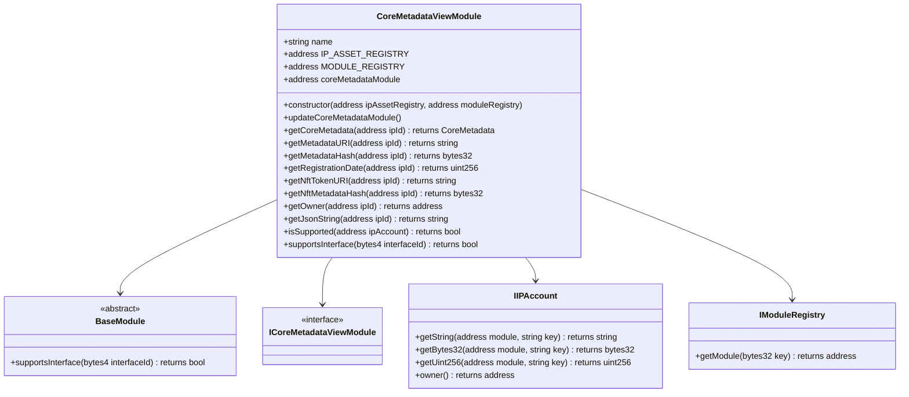

# Metadata

Contract `CoreMetadataModule` & Contract `CoreMetadataViewModule`

This contract keeps track of the relation between `ipId` and its metadata. 
The metadata is stored in the `CoreMetadataModule` contract and can be accessed by the `CoreMetadataViewModule` contract.

**This contract is like our `AssetMetadata` contract, but it is more generic and can be used for any type of metadata.**

This diagram shows the `CoreMetadataViewModule` class and its relationships with other classes and interfaces.

This diagram shows the CoreMetadataViewModule class and its relationships with other classes and interfaces.