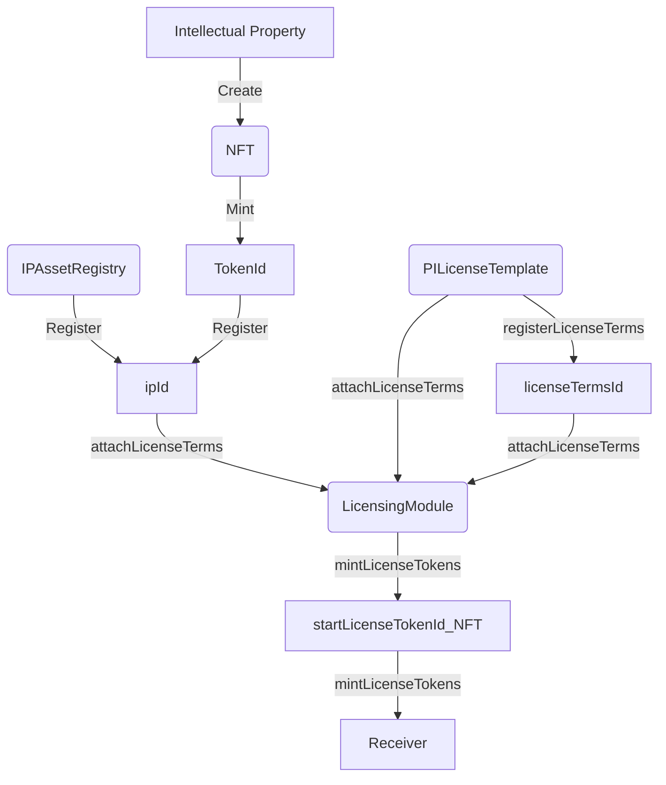

# User story

```mermaid

graph TD

    H[startLicenseTokenId_NFT]

    K[Intellectual Property]

    K[Intellectual Property] -->|Create| A(NFT)

    A(NFT) -->|Mint| B[TokenId]

    C(IPAssetRegistry) -->|Register| D[ipId]

    B[TokenId] -->|Register| D[ipId]

    E(PILicenseTemplate) -->|registerLicenseTerms| F[licenseTermsId]

    D[ipId] -->|attachLicenseTerms| G(LicensingModule)

    E(PILicenseTemplate) -->|attachLicenseTerms| G(LicensingModule)

    F[licenseTermsId] -->|attachLicenseTerms| G(LicensingModule)

    G(LicensingModule) -->|mintLicenseTokens| H

    H -->|mintLicenseTokens| I[Receiver]

```