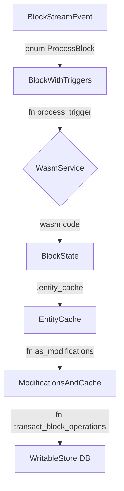
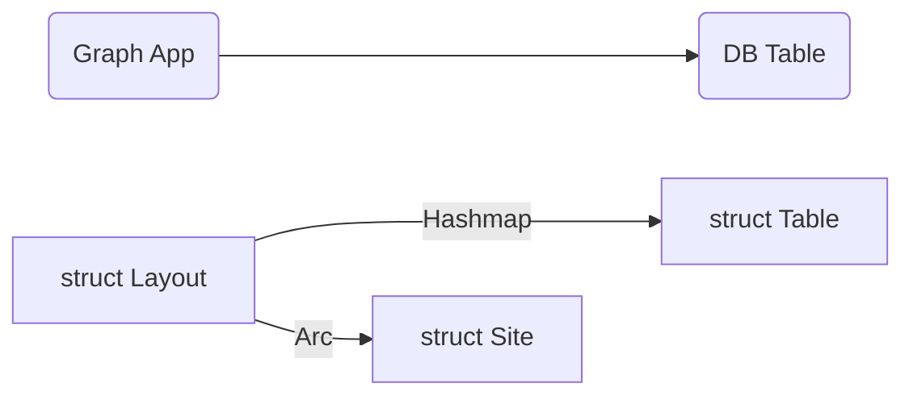

## Block Data Store Process
How block data is transformed ands stored in the database.

`core/src/subgraph/runner.rs` line 173 `async fn run_inner`


### BlockStreamEvent
Data struct from block indexer that contains the block data and the cursor to the next block.
It contains next block info or revert info, indicating what graph node need to do next.
```rust
#[derive(Debug)]
pub enum BlockStreamEvent<C: Blockchain> {
    // The payload is the block the subgraph should revert to, so it becomes the new subgraph head.
    Revert(BlockPtr, FirehoseCursor),

    ProcessBlock(BlockWithTriggers<C>, FirehoseCursor),
    ProcessWasmBlock(BlockPtr, BlockTime, Box<[u8]>, String, FirehoseCursor),
}
```

### BlockWithTriggers
Data format generated by the block stream processor that contains the block and the triggers that were generated for that block.
The triggers are transform from events in the block.
```rust
#[derive(Debug)]
pub struct BlockWithTriggers<C: Blockchain> {
    pub block: C::Block,
    pub trigger_data: Vec<C::TriggerData>,
}
```

### BlockState
A new state is created each time a block is processed. 
It contains the data sources that are created, processed, and persisted in the block.
```rust
#[derive(Debug)]
pub struct BlockState {
    pub entity_cache: EntityCache,
    pub deterministic_errors: Vec<SubgraphError>,
    created_data_sources: Vec<InstanceDSTemplateInfo>,

    // Data sources to be transacted into the store.
    pub persisted_data_sources: Vec<StoredDynamicDataSource>,

    // Data sources created in the current handler.
    handler_created_data_sources: Vec<InstanceDSTemplateInfo>,

    // data source that have been processed.
    pub processed_data_sources: Vec<StoredDynamicDataSource>,

    // Marks whether a handler is currently executing.
    in_handler: bool,

    pub metrics: BlockStateMetrics,
}
```

### EntityCache
Entity is generated from block state. It's processed info of the new block data.
The entity cache is a cache for entities from the store that provides the basic functionality needed for the store interactions in the host exports.
```rust
/// A cache for entities from the store that provides the basic functionality
/// needed for the store interactions in the host exports. This struct tracks
/// how entities are modified, and caches all entities looked up from the
/// store. The cache makes sure that
///   (1) no entity appears in more than one operation
///   (2) only entities that will actually be changed from what they
///       are in the store are changed
///
/// It is important for correctness that this struct is newly instantiated
/// at every block using `with_current` to seed the cache.
pub struct EntityCache {
    /// The state of entities in the store. An entry of `None`
    /// means that the entity is not present in the store
    current: LfuCache<EntityKey, Option<Arc<Entity>>>,

    /// The accumulated changes to an entity.
    updates: HashMap<EntityKey, EntityOp>,

    // Updates for a currently executing handler.
    handler_updates: HashMap<EntityKey, EntityOp>,

    // Marks whether updates should go in `handler_updates`.
    in_handler: bool,

    /// The store is only used to read entities.
    pub store: Arc<dyn s::ReadStore>,

    pub schema: InputSchema,

    /// A sequence number for generating entity IDs. We use one number for
    /// all id's as the id's are scoped by block and a u32 has plenty of
    /// room for all changes in one block. To ensure reproducability of
    /// generated IDs, the `EntityCache` needs to be newly instantiated for
    /// each block
    seq: u32,
}
```

### ModificationsAndCache
Convert into a list of entity modifications that can be applied to the store.
```rust
/// Intermediate result of processing EntityCache. Contains the entity
pub struct ModificationsAndCache {
    pub modifications: Vec<s::EntityModification>,
    pub entity_lfu_cache: EntityLfuCache,
    pub evict_stats: EvictStats,
}
#[derive(Clone, CacheWeight, Debug, PartialEq, Eq)]
pub enum EntityModification {
    /// Insert the entity
    Insert {
        key: EntityKey,
        data: Arc<Entity>,
        block: BlockNumber,
        end: Option<BlockNumber>,
    },
    /// Update the entity by overwriting it
    Overwrite {
        key: EntityKey,
        data: Arc<Entity>,
        block: BlockNumber,
        end: Option<BlockNumber>,
    },
    /// Remove the entity
    Remove { key: EntityKey, block: BlockNumber },
}

/// object used to store value
pub struct WritableStore {
    store: Arc<SyncStore>,
    block_ptr: Mutex<Option<BlockPtr>>,
    block_cursor: Mutex<FirehoseCursor>,
    writer: Writer,

    // Cached to avoid querying the database.
    is_deployment_synced: AtomicBool,
}
```

### Ethereum Log format
```rust
#[derive(Debug, Clone, PartialEq, Serialize, Deserialize)]
pub struct Log {
    /// H160
    pub address: H160,
    /// Topics
    pub topics: Vec<H256>,
    /// Data
    pub data: Bytes,
    /// Block Hash
    #[serde(rename = "blockHash")]
    pub block_hash: Option<H256>,
    /// Block Number
    #[serde(rename = "blockNumber")]
    pub block_number: Option<U64>,
    /// Transaction Hash
    #[serde(rename = "transactionHash")]
    pub transaction_hash: Option<H256>,
    /// Transaction Index
    #[serde(rename = "transactionIndex")]
    pub transaction_index: Option<Index>,
    /// Log Index in Block
    #[serde(rename = "logIndex")]
    pub log_index: Option<U256>,
    /// Log Index in Transaction
    #[serde(rename = "transactionLogIndex")]
    pub transaction_log_index: Option<U256>,
    /// Log Type
    #[serde(rename = "logType")]
    pub log_type: Option<String>,
    /// Removed
    pub removed: Option<bool>,
}
```

## DataBase Layout



### Site
Information about deployed graph App. It seems that for each deployment, 
there is a database that contains the deployment information.
```rust
#[derive(Debug, PartialEq)]
/// Details about a deployment and the shard in which it is stored. We need
/// the database namespace for the deployment as that information is only
/// stored in the primary database.
///
/// Any instance of this struct must originate in the database
pub struct Site {
    pub id: DeploymentId,
    /// The subgraph deployment
    pub deployment: DeploymentHash,
    /// The name of the database shard
    pub shard: Shard,
    /// The database namespace (schema) that holds the data for the deployment
    pub namespace: Namespace,
    /// The name of the network to which this deployment belongs
    pub network: String,
    /// Whether this is the site that should be used for queries. There's
    /// exactly one for each `deployment`, i.e., other entries for that
    /// deployment have `active = false`
    pub active: bool,

    pub(crate) schema_version: DeploymentSchemaVersion,
    /// Only the store and tests can create Sites
    _creation_disallowed: (),
}

```
### Layout
Each Layout is corresponding to a Graph App.
Each Graph App has multiple Table. It is stored in the Layout struct.

`store/postgres/src/deployment_store.rs`
```rust
#[derive(Debug, Clone)]
pub struct Layout {
    /// Details of where the subgraph is stored
    pub site: Arc<Site>,
    /// Maps the GraphQL name of a type to the relational table
    pub tables: HashMap<EntityType, Arc<Table>>,
    /// The database schema for this subgraph
    pub catalog: Catalog,
    /// The query to count all entities
    pub count_query: String,
    /// How many blocks of history the subgraph should keep
    pub history_blocks: BlockNumber,

    pub input_schema: InputSchema,

    /// The rollups for aggregations in this layout
    rollups: Vec<Rollup>,
}
```
### Table
Table contains the information defined in the Graph App.
```rust
#[derive(Debug, Clone)]
pub struct Table {
    /// The reference to the underlying type in the input schema. For
    /// aggregations, this is the object type for a specific interval, like
    /// `Stats_hour`, not the overall aggregation type `Stats`.
    pub object: EntityType,

    /// The name of the database table for this type ('thing'), snakecased
    /// version of `object`
    pub name: SqlName,

    /// The table name qualified with the schema in which the table lives,
    /// `schema.table`
    pub qualified_name: SqlName,

    pub columns: Vec<Column>,

    /// This kind of entity behaves like an account in that it has a low
    /// ratio of distinct entities to overall number of rows because
    /// entities are updated frequently on average
    pub is_account_like: bool,

    /// The position of this table in all the tables for this layout; this
    /// is really only needed for the tests to make the names of indexes
    /// predictable
    position: u32,

    /// Entities in this table are immutable, i.e., will never be updated or
    /// deleted
    pub(crate) immutable: bool,

    /// Whether this table has an explicit `causality_region` column. If `false`, then the column is
    /// not present and the causality region for all rows is implicitly `0` (equivalent to CasualityRegion::ONCHAIN).
    pub(crate) has_causality_region: bool,
}
```