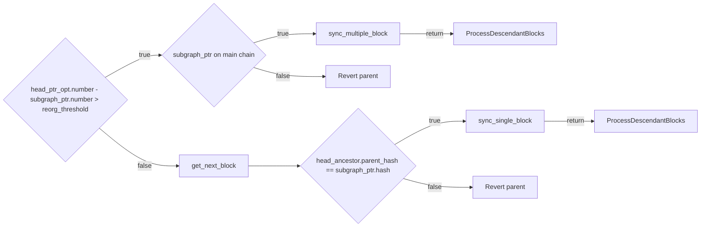

## BlockSynchronized
path `graph/src/blockchain/polling_block_stream.rs`

line 215 `async fn get_next_step(&self)`

### Param explain
`head_ptr_opt` currently the block we got from rpc service.

`subgraph_ptr` block subgraph have synchronized in db.

`reorg_threshold` and important constant we set for block synchronized.

