## GraphQL handle
How does graph QL achieves fast query response time? This is how it's implemented.

path `graphql/src/execution/execution.rs`

line 321 `pub(crate) async fn execute_root_selection_set`

```mermaid
    graph LR
        A[GraphQL Query]
        B[QUERY_BLOCK_CACHE]
        C[QUERY_LFU_CACHE]
        D[QUERY_HERD_CACHE]
        F[Query DB]
        G[Query DB Done!]
        H[Return Query Result]
        
        X{Recent Block}
        Y{Query DB existing}
        Z{is memory cache on}
        
        A --> Z
        Z --> |true|B
        B --> |not contain| C
        C --> |not contain| F
        Z --> |false|F
        F --> Y
        Y --> |true|D
        Y --> G
        D --> G
        G --> |Release cache|QUERY_HERD_CACHE
        QUERY_HERD_CACHE --> X
        X --> |true|QUERY_BLOCK_CACHE
        X --> |false|QUERY_LFU_CACHE
        QUERY_BLOCK_CACHE --> H
        QUERY_LFU_CACHE --> H

    
```


### QUERY_BLOCK_CACHE
Recent block cache. When queried, the cache will be checked first. If the cache does not contain the block, the query will be executed in the database.

```rust
    // Sharded query results cache for recent blocks by network.
    // The `VecDeque` works as a ring buffer with a capacity of `QUERY_CACHE_BLOCKS`.
    static ref QUERY_BLOCK_CACHE: Vec<TimedMutex<QueryBlockCache>> = {
            let shards = ENV_VARS.graphql.query_block_cache_shards;
            let blocks = ENV_VARS.graphql.query_cache_blocks;

            let mut caches = Vec::new();
            for i in 0..shards {
                let id = format!("query_block_cache_{}", i);
                caches.push(TimedMutex::new(QueryBlockCache::new(blocks, i, *MAX_WEIGHT), id))
            }
            caches
    };
```

### QUERY_LFU_CACHE
History block cache. Query for historical blocks is not that much often comparing to recent block.
So there is `QUERY_LFU_CACHE` specially for historical block cache.
```rust
    lazy_static! {
        static ref QUERY_LFU_CACHE: Vec<TimedMutex<LfuCache<QueryHash, WeightedResult>>> = {
            std::iter::repeat_with(|| TimedMutex::new(LfuCache::new(), "query_lfu_cache"))
                .take(ENV_VARS.graphql.query_lfu_cache_shards as usize)
                .collect()
        };
    }
```

### QUERY_HERD_CACHE
Herd effect query. When simultaneously query for the same block, the query will be executed only once and the result will be shared.
```rust
static ref QUERY_HERD_CACHE: HerdCache<Arc<QueryResult>> = HerdCache::new("query_herd_cache");
```

## Websocket Subscription
GraphQL query can also be subscribed to a websocket.

path `server/websocket/src/connection.rs` 

line 204 `async fn handle_incoming_messages`
