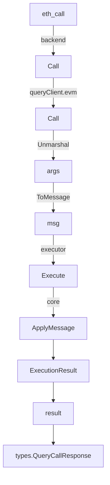

# eth_call

```mermaid
graph TD
    eth_call --> |backend|Call1[Call]
    Call1 --> |queryClient.evm|Call2[Call]
    Call2 --> |Unmarshal|args
    args --> |ToMessage|msg
    msg --> |executor|Execute
    Execute --> |core|ApplyMessage
    ApplyMessage --> ExecutionResult
    ExecutionResult --> result
    result --> types.QueryCallResponse
```
